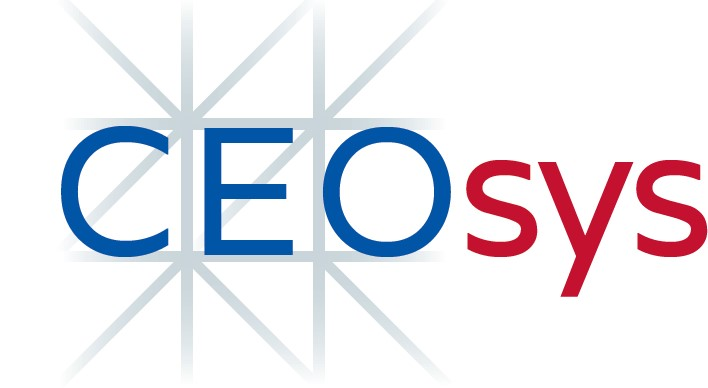

CEO-sys AP5 automatic guideline adherence evaluator
######################################################




Introduction
============
Development of a software-based automated evaluation of the adherence to clinical guidelines in the context of the
[CEO-sys - COVID-19 Evidenz-Ökosystems zur Verbesserung von Wissensmanagement und -translation](https://covid-evidenz.de/).

Quickstart
==========

1. Clone repository
   ..code-block shell
   git clone https://github.com/glichtner/ceosys.git
   ```
2. Build docker containers
   ``` shell
   cd ceosys/
   docker-compose build
   ```
3. Run containers
   ``` shell
   docker-compose up
   ```
4. Visit dashboard at http://localhost:5000/
